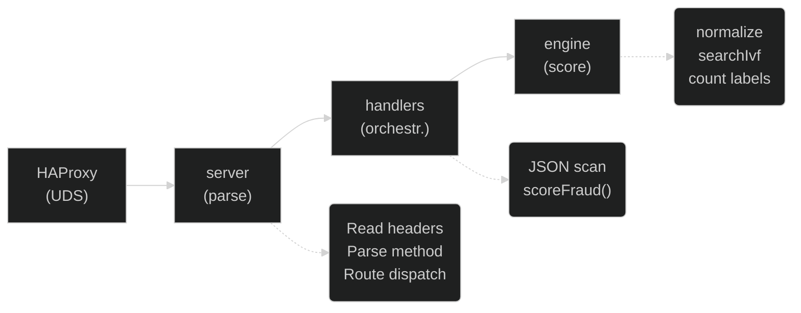
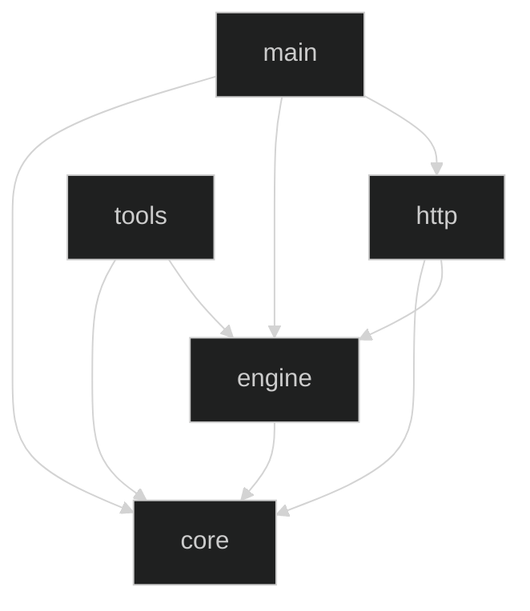

# Architecture — rinha-de-backend-2026

Zig 0.16.0 fraud-detection server for
[Rinha de Backend 2026](https://github.com/zanfranceschi/rinha-de-backend-2026).

## Core Principles

- **Zig 0.16.0**: Unified I/O layer using `std.Io` with native **`io_uring`**
  support and `SQPOLL` for zero-syscall networking.
- **Native SIMD Engine**: Core vector search engine (`searchKnn`) implemented
  with Zig `@Vector` and **Threshold Pruning** for maximum throughput.
- **Zero-Allocation**: Custom JSON scanner and lock-free arena allocation for
  minimalist request handling.
- **Shared Memory**: Uses `mmap` to load the dataset and labels into memory for
  high-speed access. The 14-dimensional business vectors are intentionally
  padded to **16D SoA (Structure of Arrays)** to ensure perfect memory alignment
  for AVX2/SIMD operations.

## Request Flow



1. **HAProxy** distributes load across N instances via Unix domain sockets.
2. **`http/server.zig`** accepts connections, parses HTTP/1.1 headers, and
   dispatches to a handler via the comptime `Router`.
3. **`http/handlers.zig`** orchestrates: parses JSON body, calls
   `engine.scoring.scoreFraud()`, writes the response.
4. **`engine/scoring.zig`** runs the pure business pipeline:
   `normalize -> pad -> searchIvf -> count labels`.

## Module Dependency Graph



All dependencies flow **downward**. No cycles. Enforced via `build.zig` modules.

## Domain Boundaries

| Module        | Responsibility                                                            | I/O? | HTTP? |
| ------------- | ------------------------------------------------------------------------- | ---- | ----- |
| **`core/`**   | Domain types (`TransactionPayload`), JSON scanning, feature normalization | ✗    | ✗     |
| **`engine/`** | Vector search (`searchIvf`), fraud scoring pipeline (`scoreFraud`)        | ✗    | ✗     |
| **`http/`**   | TCP/UDS server, HTTP parsing, routing, response formatting                | ✓    | ✓     |
| **`tools/`**  | Offline data preparation (K-Means clustering, binary file generation)     | ✓    | ✗     |

## Directory Structure

```
src/
├── main.zig                 ← entry point: resource loading → server start
├── core/
│   ├── root.zig             ← barrel: re-exports json + norm
│   ├── json.zig             ← zero-alloc JsonScanner + TransactionPayload
│   └── norm.zig             ← normalize() + Feature enum + NormalizationConstants
├── engine/
│   ├── root.zig             ← barrel: re-exports ivf + scoring
│   ├── ivf.zig              ← SoADataset, IvfIndex, searchIvf (SIMD)
│   └── scoring.zig          ← scoreFraud() — pure business pipeline
├── http/
│   ├── root.zig             ← barrel: re-exports context, handlers, server, responses
│   ├── context.zig          ← AppContext, Method, Request (shared types)
│   ├── server.zig           ← accept loop, HTTP/1.1 parsing, Router (transport only)
│   ├── handlers.zig         ← handleReady, handleFraudScore (thin adapters)
│   └── responses.zig        ← comptime-generated HTTP response strings
└── tools/
    ├── data_prep.zig        ← offline K-Means + binary writer
    └── data_prep_cli.zig    ← CLI entry point
tests/
└── e2e.zig                  ← integration tests (mock AppContext + real HTTP)
```

## Build Targets

| Command          | Description                                  |
| ---------------- | -------------------------------------------- |
| `zig build`      | Build the `rinha` server (x86_64-linux-musl) |
| `zig build run`  | Build and run the server                     |
| `zig build test` | Run unit tests (JSON, normalization, IVF)    |
| `zig build e2e`  | Run E2E integration tests                    |
| `zig build prep` | Run the data preparation pipeline            |
| `zig build fmt`  | Format all source files                      |
